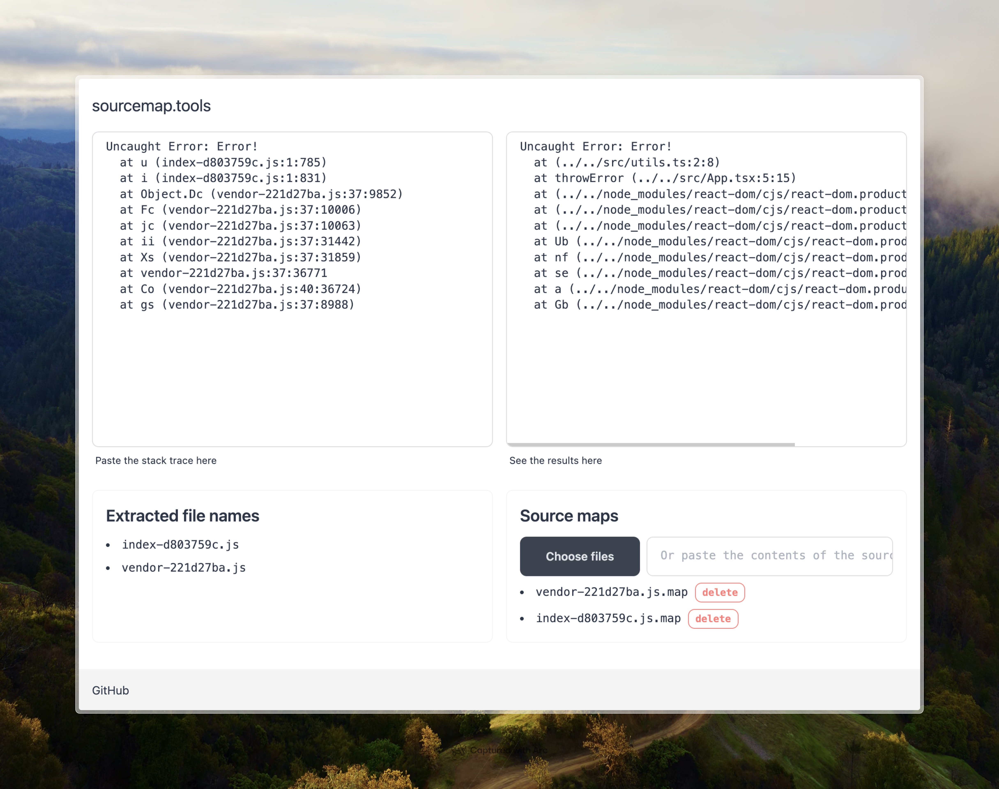

# sourcemap.tools




This repo contains the source code for the https://sourcemap.tools.

This little web app allows you to paste a stack trace of minified JavaScript code, apply source maps to it, and see the original positions of the errors.

The application may help investigate errors in production if you do not host source maps but can still extract them from build artifacts.

Inspired by https://sourcemaps.info/, but does everything on the client and does not try to fetch sources or source maps.

## How to use

1. Paste your stack trace on the left.
2. Provide source maps by choosing files or pasting the content of the source map.
3. See the results on the right.

## Development

1. Clone the repository
2. Go to the project's directory and install dependencies

   ```shell
   npm ci
   ```

3. Run and go to http://localhost:5173/

   ```shell
   npm run dev
   ```

4. Optionally run tests

   ```shell
   npm test
   ```
